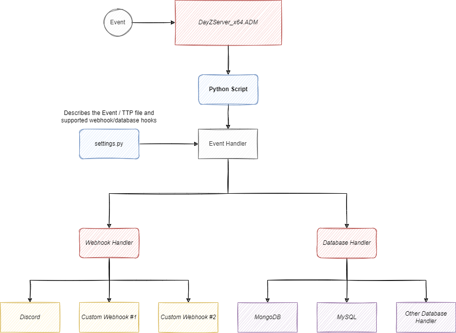

# DayZ Log Hook

This is a simply python script which essentially looks at the administrator logs (ADM) and is highly expandable. I was sick of all the solutions out on the internet (or maybe I wasn't looking properly) but have tried my best to make this very user friendly as long as you can follow these instructions. This python script should always be running so ensure you monitor the script and launch it again if it isn't found, later I will extend it into a windows service so you can make it auto-restart/start when something goes wrong locally on your server.

The only dependency you need is Python on your Windows server.

### Flow



### Settings

Ensure you edit the settings.py and change the following for a great experience:

1) Change the Discord <change_me> webhook to your Discord webhook channel to enable messages
2) Change the `ADMIN_LOG_FILE` variable to reflect the location where your .ADM file is located. This will always be in the same directory that you specify --profile when running a server.


### Adding a new Event

If you want to record a new event, you will need to perform the following:

1) Create the event in a separate python file under `events`. This should look something like this:

events\some_mod.py
```
from modules.event import Event

class EventSomeModSpecific(Event):
    def handle_discord(self):
        pass
```

2) Create the template under `templates` folder with the .ttp extension to filter the data within the log using TTP format (https://ttp.readthedocs.io/en/latest/Quick%20start.html) - An online tool can be used to test your log against a specific filter here (https://textfsm.nornir.tech/)

For example, if I want to match a Chat event which is a Vanillia log therefore the format can be found here https://community.bistudio.com/wiki/DayZ:Administration_Logs#Logged_events, my ttp template will be stored as `templates\some_mod_specific.ttp` and contain the following:

```
{{ event_time }} | Player "{{ player_name }}" (DEAD) (id={{ player_guid }} pos={{ pos_x }}, {{ pos_y }}, {{ pos_z }}) died. Stats> Water: {{ stats_water }} Energy: {{ stats_energy }} Bleed sources: {{ stats_bleed_sources }}
```

3) I can now implement a function in my EventSomeModSpecific that I created in step 1 to handle the discord webhook data. Example:

```
from modules.event import Event

class EventSomeModSpecific(Event):
    def handle_discord(self):
        return self.event_text, f"""Player {self.data["player_name"]} died..."""
```

Notice I am accessing the filtered data via `self.data["player_name"]`. If the event is not processed (eg. data isn't matched) then this handle_discord method will not be called.

4) Finally, I need to attach this Event in my `settings.py` like this:

```
EVENTS = [
    EventChat("chat", "Chat Message", "chat.ttp", supported_webhooks=WEBHOOKS), # Added this one here
    EventDisconnect("disconnect", "Player Disconnected", "disconnected.ttp", supported_webhooks=WEBHOOKS),
    EventCOTHealed("cot_healed", "[COT] Healed", "cot_healed.ttp", supported_webhooks=WEBHOOKS)
]
```

### Adding new Webhook support

To add a new webhook you must create a file inside `webhooks` folder and create a class with the format of "Webhook<Name>", for example the Discord webhook is called WebhookDiscord. This class must always inherit `WebhookGeneric` by importing it and extending your class to use it, for example:

```
from webhooks.generic import WebhookGeneric

class WebhookDiscord(WebhookGeneric):
    def handle_webhook(self, event):
        pass
```

Notice, you must always create handle_webhook with (self, event) because the Event method `process` will attempt to call this method for every webhook supported by the Event, the `event` variable will give you access to your Event data. Your logic will then be implemented inside this method, for example the discord method will process the title and description of an Event as such:

```
class WebhookDiscord(WebhookGeneric):
    """Format: Title, Message"""
    def handle_webhook(self, event):
        check_attr = getattr(event, "handle_discord", None)
        if not callable(check_attr):
            logger.error(f"Unable to send Discord webhook message for {event.event_name} due to method 'handle_discord' being implemented incorrectly.")

        title, message = event.handle_discord()

        webhook = DiscordWebhook(url=self.url)
        embed = DiscordEmbed(title=title, description=message)
        webhook.add_embed(embed)
        webhook.execute()
```

Any new webhook you implement must also have a function within the Event called `handle_<name of webhook>`. To support the discord webhook, your event must have a method called `handle_discord`. You must manually add support for your new webhook to all the events, all vanillia events will have support for Discord and planned support for databasehooks will include MongoDB (so your logs can go to a database which you can pull inside your website for things like kill stats and death stats)

If you have any questions or ideas for improvement then please feel free to join the discord at: https://dsc.gg/peytnuc_dayz and post in the support channel. Feel free to also take a look at our discord to examples of these events working in-game. Currently the support for per-webhook Event is a bit wack, if you want to specifically only send certain Events across different discord channels, then you must create a new `WebhookDiscord` in your settings.py and add that to your specific event. For example, if you have a generic discord channel and a killfeed channel you will need to do something like this:

```
WEBHOOKS = [
    WebhookDiscord("https://discord.com/api/webhooks/<webhook1>") # Admin Channel
]

EVENTS = [
    EventChat("chat", "Chat Message", "chat.ttp", supported_webhooks=WEBHOOKS),
    EventDisconnect("disconnect", "Player Disconnected", "disconnected.ttp", supported_webhooks=WEBHOOKS),
    EventCOTHealed("cot_healed", "[COT] Healed", "cot_healed.ttp", supported_webhooks=WEBHOOKS),
    EventSuicide("suicide", "Player Died", "suicide.ttp", supported_webhooks=[WebhookDiscord("https://discord.com/api/webhooks/<webhook2>")]) # Generic Channel
]
```